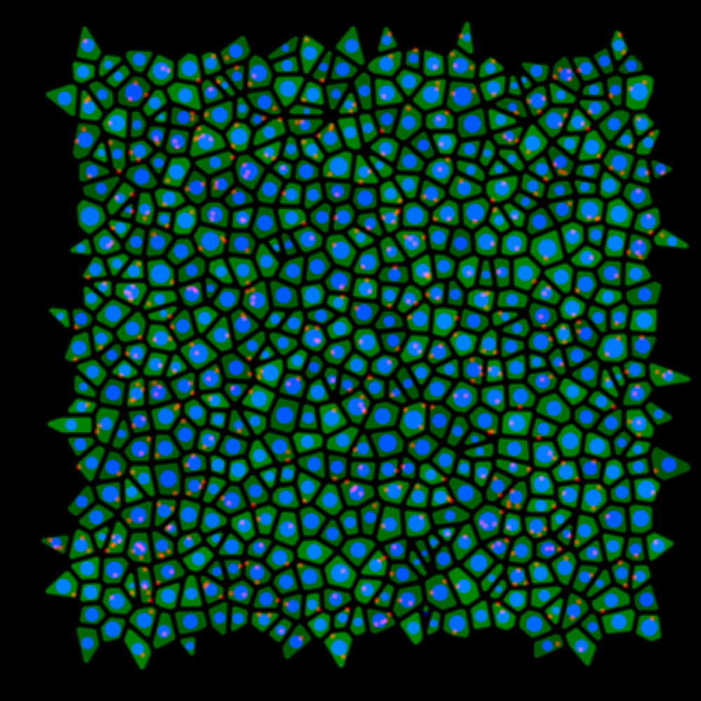

# HWImageGenerator
Homework Image Generation for Students Learning Basic ImageJ Functions.

This script generate model images for leraning basic ImageJ functions. Each set of images contain green (full cell), nucleus (blue) and red (lysosomes?) image, and also .csv with area and nucleus radii data. 

"Сells" are generated based on the Voronoi Diagramm algoritm, with nucleus in centroid of each polygon. Polygons a eroded and dilated so they look more cell-like, not just geometric shapes. The "Nucleus" located in the centroid of each polygon, and "lysosomes" randomly distributed over all of "cells", not all cells get lysosomes.

